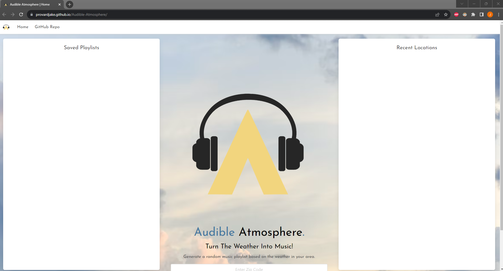

# Audible-Atmosphere

## Descirption
This application will allow the User to enter in a zip code and it will display the current weather and generate a randomized playlist of 10 songs based on the weather conditions in that location. The user can then save the playlist and their most recent saved playlist will be displayed on the front page. 

## Technologies Used
This application uses HTML, CSS, JavaScript and Bulma as a CSS library. We are also using the openweathermap api to get the users weather and they deezer api to generate the playlist. 

## Screenshot of Deployed Application

## Link to Deployed Application
https://provardjake.github.io/Audible-Atmosphere/
